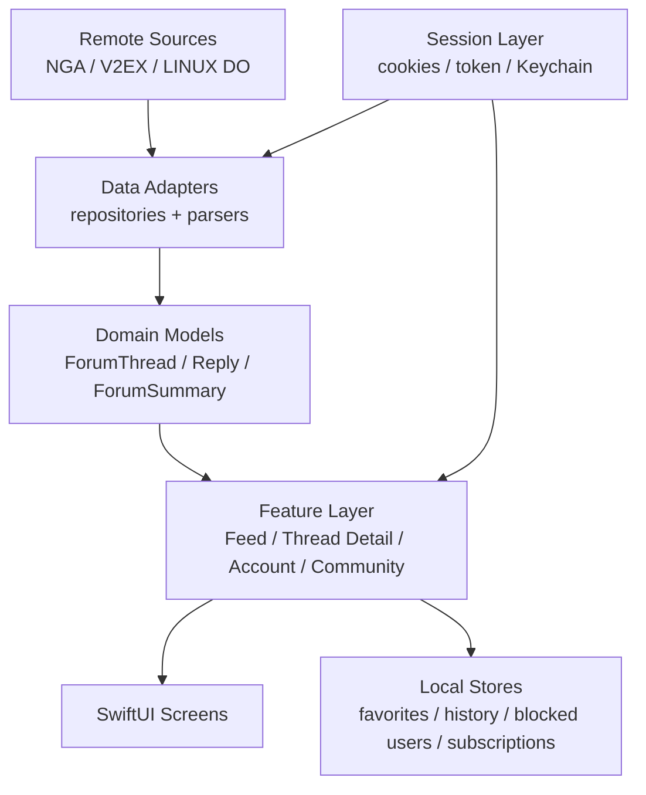

# ForumHub

ForumHub is a multi-community iOS reader built with SwiftUI.

It currently integrates:

- NGA
- V2EX
- LINUX DO

The app focuses on fast reading, lightweight account capabilities, and source-specific adapters behind a shared domain model.

## Supported Sources

| Source | Feed | Detail | Login | Favorites | Reply |
| --- | --- | --- | --- | --- | --- |
| NGA | Yes | Yes | Web + Cookies | Yes | Yes |
| V2EX | Yes | Yes | Token | Local only | No |
| LINUX DO | Yes | Yes | Web + Cookies | Local only | No |

## Current Capabilities

- Multi-source home feed with channel switching
- Channel subscription and manual reordering
- Thread detail with floor labels, only-author mode, reverse order, and pagination
- Thread favorites, blocked users, browsing history, and local persistence
- NGA web login with cookie reuse
- LINUX DO web login with cookie reuse
- Thread reply support, including NGA image attachments
- In-thread image preview, GIF playback, save-to-photos, and zoom

## Project Structure

```text
ForumHub/
├── ForumHub/                # App source
├── ForumHubTests/           # Unit tests and fixtures
├── ForumHubUITests/         # UI tests
├── docs/                    # Product and engineering docs
├── CONTEXT.md               # Domain language and invariants
├── AGENTS.md                # AI/collaboration conventions
└── README.md
```

## Core Modules

- `ForumHub/Data`: source adapters and parsers
- `ForumHub/Domain`: shared models and parsing helpers
- `ForumHub/Features`: user-facing SwiftUI features
- `ForumHub/Session`: login, cookies, and credential storage
- `ForumHub/Sync`: reserved area for sync-related work
- `ForumHub/DesignSystem`: shared theme and visual components

## Run Locally

1. Open [ForumHub.xcodeproj](/Users/v/XBP/ForumHub/ForumHub.xcodeproj).
2. Select the `ForumHub` scheme.
3. Build and run on a connected iOS device when one is available.

## Common Workflows

- Build app: run the `xcodebuild` command below
- Read domain terms first: open [CONTEXT.md](/Users/v/XBP/ForumHub/CONTEXT.md)
- Understand repository boundaries: open [docs/architecture.md](/Users/v/XBP/ForumHub/docs/architecture.md)
- Continue feature work: open the relevant module note under [docs/modules](/Users/v/XBP/ForumHub/docs/modules)

Example device build command:

```sh
/Applications/Xcode-beta.app/Contents/Developer/usr/bin/xcodebuild \
  -project ForumHub.xcodeproj \
  -scheme ForumHub \
  -configuration Debug \
  -destination 'platform=iOS,id=<CONNECTED_DEVICE_ID>' \
  build
```

If no iOS device is currently available, skip the build instead of falling back to a simulator build.

## Documentation

- [CONTEXT.md](/Users/v/XBP/ForumHub/CONTEXT.md)
- [AGENTS.md](/Users/v/XBP/ForumHub/AGENTS.md)
- [docs/architecture.md](/Users/v/XBP/ForumHub/docs/architecture.md)
- [docs/decisions.md](/Users/v/XBP/ForumHub/docs/decisions.md)
- [docs/roadmap.md](/Users/v/XBP/ForumHub/docs/roadmap.md)
- [docs/changelog.md](/Users/v/XBP/ForumHub/docs/changelog.md)
- [docs/modules](/Users/v/XBP/ForumHub/docs/modules)
- [docs/modules/feature-matrix.md](/Users/v/XBP/ForumHub/docs/modules/feature-matrix.md)
- [docs/modules/search-and-discovery.md](/Users/v/XBP/ForumHub/docs/modules/search-and-discovery.md)
- [docs/modules/image-handling.md](/Users/v/XBP/ForumHub/docs/modules/image-handling.md)
- [docs/modules/testing-and-fixtures.md](/Users/v/XBP/ForumHub/docs/modules/testing-and-fixtures.md)
- [docs/modules/persistence-and-sync.md](/Users/v/XBP/ForumHub/docs/modules/persistence-and-sync.md)
- [docs/archive](/Users/v/XBP/ForumHub/docs/archive)

## High-Level Map


