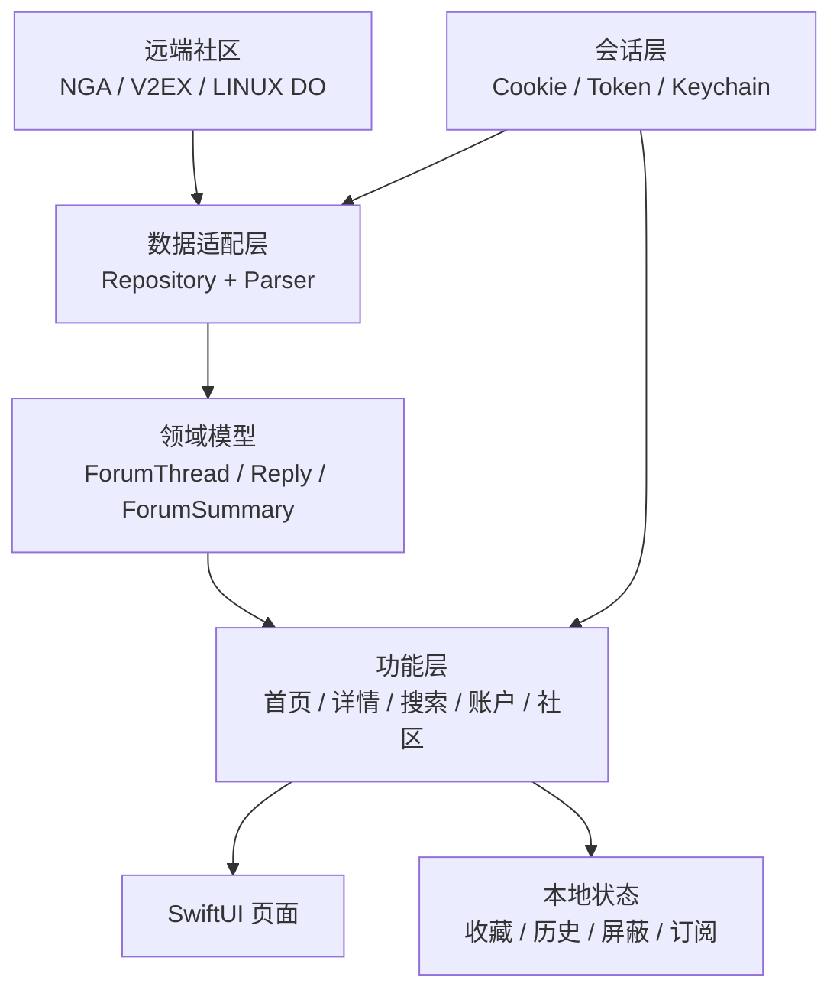

# ForumHub

ForumHub 是一个使用 SwiftUI 开发的多社区 iOS 阅读客户端，目前接入：

- NGA
- V2EX
- LINUX DO

项目目标是在统一领域模型和阅读体验之上，通过数据源适配器隔离各社区的接口、解析、登录和业务差异。

## 当前能力

| 数据源 | 列表 | 详情 | 登录 | 收藏 | 回复 |
| --- | --- | --- | --- | --- | --- |
| NGA | 支持 | 支持 | Web + Cookie | 支持 | 支持 |
| V2EX | 支持 | 支持 | Token + Web Cookie | 支持 | 暂不支持 |
| LINUX DO | 支持 | 支持 | Web + Cookie | 暂不支持 | 暂不支持 |

主要功能：

- 多数据源首页与频道切换；
- 频道订阅、显示管理和手动排序；
- 帖子详情、楼层标签、只看楼主、倒序和连续分页；
- 收藏、屏蔽用户、浏览历史和本地持久化；
- NGA、LINUX DO Web 登录与 Cookie 复用；
- V2EX Token 登录；
- NGA 帖子回复和图片附件；
- 帖内图片预览、GIF 播放、缩放与保存到相册。

## 项目结构

```text
ForumHub/
├── ForumHub/                 # App 源码
│   ├── Data/                 # 数据源适配、Repository、Parser、DTO 映射
│   ├── Domain/               # 共享领域模型
│   ├── Features/             # SwiftUI 功能页面
│   ├── Session/              # 登录、Cookie、Token、Keychain
│   ├── DesignSystem/         # 主题与可复用 UI
│   └── Sync/                 # 同步扩展点
├── ForumHubTests/            # 单元测试与 Fixtures
├── ForumHubUITests/          # UI 测试
├── docs/                     # 产品、架构、模块和 AI 协作文档
├── CONTEXT.md                # 详细领域上下文与业务不变量
├── AGENTS.md                 # AI Agent 全局协作规则
└── README.md
```

## 开始开发前

建议按以下顺序阅读：

1. [AGENTS.md](AGENTS.md)
2. [docs/context.md](docs/context.md)
3. [CONTEXT.md](CONTEXT.md)
4. [docs/architecture.md](docs/architecture.md)
5. [docs/decisions.md](docs/decisions.md)
6. [docs/todo.md](docs/todo.md)
7. 当前功能对应的 [docs/modules](docs/modules/) 文档
8. [NGA-API-完整开发文档.md](docs/NGA-API-完整开发文档.md)(推测可能与真实有差异如果已实际为准)

执行代码 Review 时，额外阅读 [docs/review.md](docs/review.md)。常用 AI 提示词位于 [docs/prompts.md](docs/prompts.md)。

## 本地运行

1. 使用 Xcode 打开 [ForumHub.xcodeproj](ForumHub.xcodeproj)。
2. 选择 `ForumHub` Scheme。
3. 优先连接 iOS 真机进行构建和运行。

```sh
/Applications/Xcode-beta.app/Contents/Developer/usr/bin/xcodebuild \
  -project ForumHub.xcodeproj \
  -scheme ForumHub \
  -configuration Debug \
  -destination 'platform=iOS,id=<CONNECTED_DEVICE_ID>' \
  build
```

当前没有可用真机时，可以记录“未执行构建”，不应把模拟器结果默认视为真机等价验证。

## 文档入口

- [AI Agent 协作规范](AGENTS.md)
- [项目上下文摘要](docs/context.md)
- [完整领域上下文](CONTEXT.md)
- [架构说明](docs/architecture.md)
- [技术决策](docs/decisions.md)
- [开发路线图](docs/roadmap.md)
- [待办清单](docs/todo.md)
- [测试策略](docs/testing.md)
- [代码 Review 规范](docs/review.md)
- [常用 AI 提示词](docs/prompts.md)
- [变更记录](docs/changelog.md)
- [模块文档](docs/modules/)
- [历史归档](docs/archive/)

## AI Review 使用方式

可以直接向 Codex 或其他 Agent 输入：

```txt
请先阅读 README.md、AGENTS.md、docs/context.md、CONTEXT.md、docs/architecture.md、
docs/decisions.md、docs/todo.md 和 docs/review.md。
按照 docs/review.md 对当前改动进行 Review，所有分析、问题、待办和总结使用简体中文。
将可执行问题同步到 docs/todo.md；只有代码已修改、验收标准满足并完成必要验证后，
才能自动勾选对应待办。无法验证时保持未完成并标记原因。
```

## 高层架构


